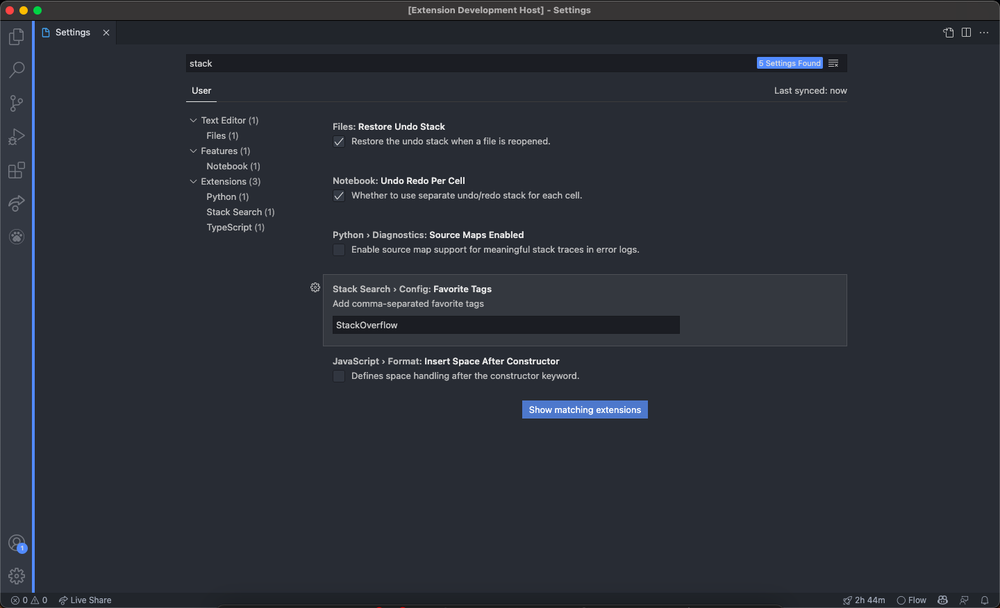
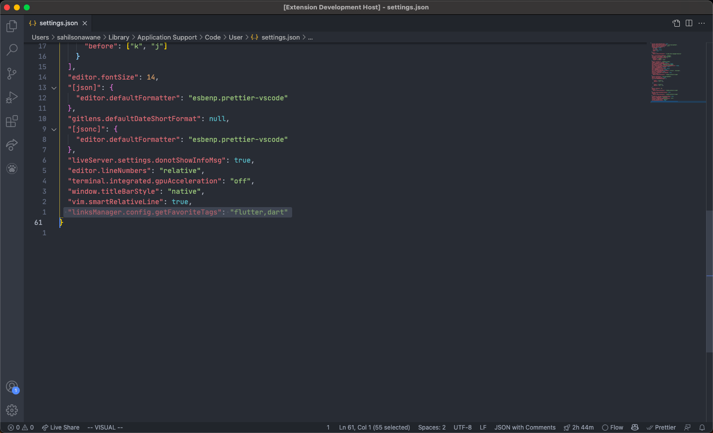

# Stack Search

Stack Search is an open-source extension for VSCode to search on stack overflow. This extension is for developers who actively surf questions on stack overflow to view, comment, answer, cast votes on their particular field / tech stack of choice.

Demo:

## Features

1. Search questions with Tags:

- Specify the tags in the input (comma-separated) and get questions containing those tags.

2. Search questions with Favorite Tags:

- Configure favorite tags under settings.
- Can be achieved either with GUI VSCode settings and under StackSearch. Screenshot below.
  
- Or adding `"linksManager.config.getFavoriteTags": "tag1,tag2"` to settings.json file. (Replace the tag1 and tag2 with your own). Screenshot below.
  

3. Search questions with Query:

- Specify the query in the input and get questions containing those tags.
- **Hint**: To get more appropriate results, use minimum amount of keywords. For Eg.: `split list in python` instead of `how to split a list in python?`
<!-- ## Requirements

If you have any requirements or dependencies, add a section describing those and how to install and configure them. -->

## Extension Settings

This extension contributes the following settings:

- `stackSearch.config.favoriteTags`: Add favorite (comma-separated) tags to search for (defaults to stackoverflow)

<!-- ## Known Issues -->

## Release Notes

### 0.0.1

Initial release of StackSearch with Search with tags, favorite tags & query.

### 0.0.2

README Update

### 0.0.3

Description Update

### 0.0.4

Favorite tags search issue resolution (iteration 1)

### 0.0.5

Favorite tags search issue resolution (iteration 2) (final)

### For Issues / Pull Requests

Contributions are welcomed :)

https://github.com/iamsahilsonawane/stack_search
